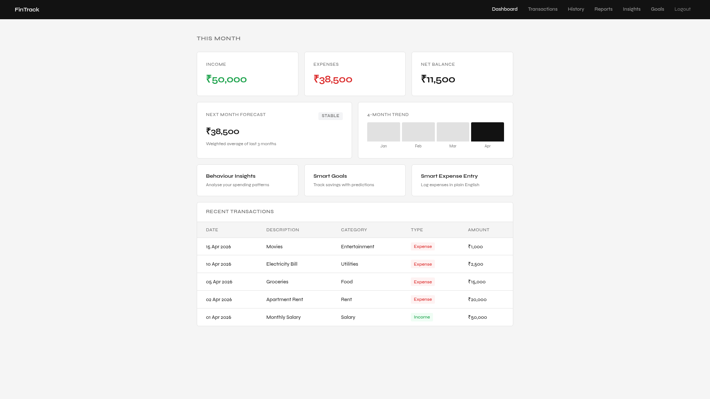
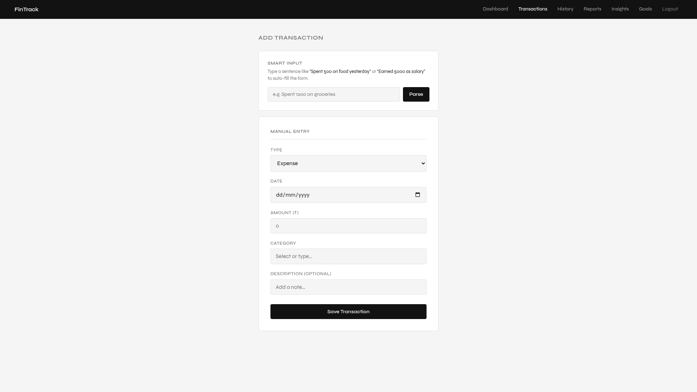
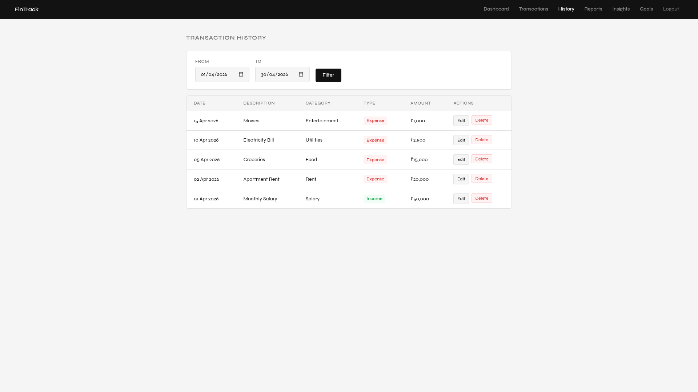
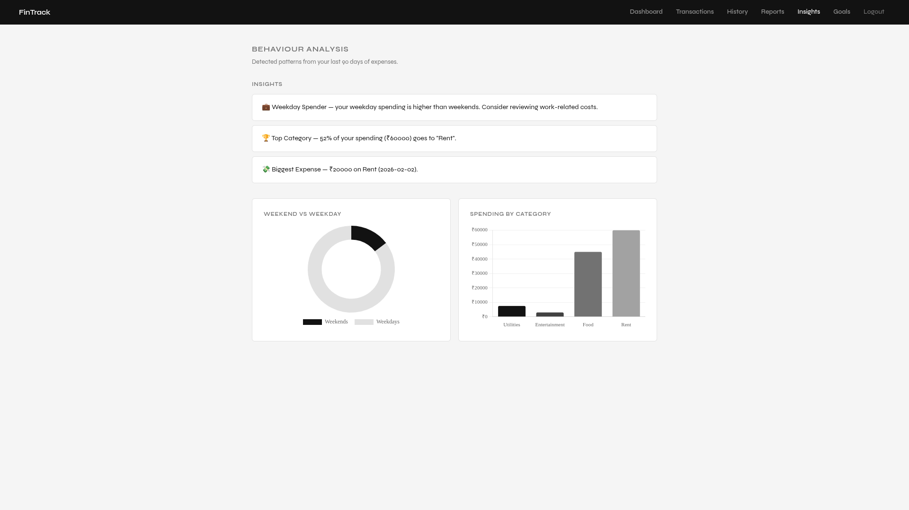

# FinTrack

FinTrack is a clean, modern, and minimalist web-based finance tracker built on Spring Boot. It empowers users to seamlessly log their incomes and expenses, visualize their data over time using dynamic charts, and explicitly trace transaction histories with full editing and deletion controls.

---

## 🎨 Screenshots

### Dashboard


### Expense/Income Entry


### Database History & Mutability


### Visual Reports


---

## 🚀 Features

*   **User Authentication**: Secured sessions handling User Registration and Logins.
*   **Intuitive Dashboard**: Overview of current month’s income, expenses, and net balance alongside your most recent transactions.
*   **Income & Expense Tracking**: Simple native HTML forms utilizing smart `datalists` for categories allowing users to group tracking efficiently.
*   **Transaction History**: View all transactions globally with an integrated Date Range filter.
*   **Full CRUD Control**: Native mechanisms allowing users to `Edit` past amounts/descriptions or securely `Delete` false entries natively triggering database cascade updates.
*   **Analytics Reports**: Integrated Chart.js visualizations rendering monthly aggregated data explicitly segregated chronologically and categorically in a stacked bar chart.
*   **Persistent MariaDB Backend**: Real relational mapping utilizing Java JPA and Hibernate ensuring robust scalable data storage securely.

---

## 🛠️ Technology Stack

*   **Backend Application**: Java, Spring Boot, Spring MVC, Spring Data JPA
*   **Frontend Templating**: HTML5, Vanilla CSS3 (Minimalist Custom System Design), Thymeleaf
*   **Database**: MariaDB / MySQL coupled with Hibernate
*   **Data Visualization**: Chart.js (CDN Embedded)

---

## 📂 Project Structure

```
fintrack/
├── src/
│   ├── main/
│   │   ├── java/com/financetracker/fintrack/
│   │   │   ├── FintrackApplication.java    # Application entry point
│   │   │   ├── controller/                 # HTTP routing (MainController, TransactionController, AuthController)
│   │   │   ├── model/                      # JPA Entities (User, Transaction)
│   │   │   ├── repository/                 # Database interfaces mapping SQL directly via Spring Data
│   │   │   └── service/                    # Business Logic bridging Controllers to Repositories
│   │   └── resources/
│   │       ├── application.properties      # DB config & Spring configuration
│   │       └── templates/                  # Thymeleaf HTML views
│   │           ├── index.html              # Dashboard Template
│   │           ├── login.html              # Login Screen
│   │           ├── register.html           # Registration Screen
│   │           ├── income.html             # Add Income Form
│   │           ├── expense.html            # Add Expense Form
│   │           ├── history.html            # Filtering Timeline View
│   │           ├── edit-transaction.html   # Dedicated mutability view
│   │           └── reports.html            # Chart.js Visualizations
├── pom.xml                                 # Maven dependencies
└── README.md                               # Project documentation
```

---

## ⚙️ Setup and Installation

### Prerequisites
*   **Java 17** (or above)
*   **Maven** (or use the included `./mvnw` wrapper)
*   **MariaDB** / **MySQL** Server

### 1. Configure the Database
1. Create a logical schema in your MariaDB instance (e.g. `fintrack`).
2. Update the Spring Boot configuration found in `src/main/resources/application.properties` with your explicit database user credentials:
```properties
spring.datasource.url=jdbc:mariadb://localhost:3306/fintrack
spring.datasource.username=YOUR_DB_USERNAME
spring.datasource.password=YOUR_DB_PASSWORD
spring.jpa.hibernate.ddl-auto=update
```

### 2. Build the Application
In your project's root folder, execute a native Maven clean compilation:
```bash
./mvnw clean install
# OR
mvn clean compile
```

### 3. Run the Application
Start the Spring Boot web server locally:
```bash
./mvnw spring-boot:run
# OR
mvn spring-boot:run
```

The application spins up an embedded Apache Tomcat engine natively resolving routes on port 8080.
**Open your browser and navigate to:** `http://localhost:8080`
